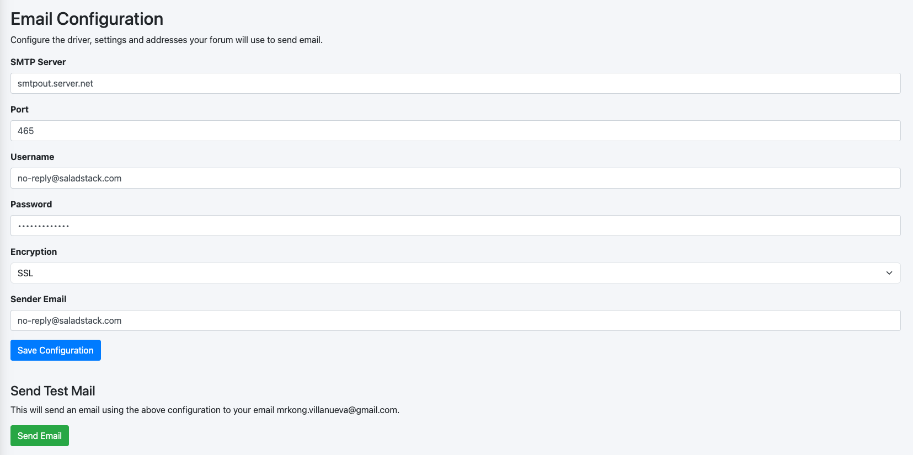

# Salad Dressing Mailer
SaladStack Extension to send mail using PHPMailer

### To Install
```bash
composer require salad-dressing/mailer
```

### To Update
```bash
composer update salad-dressing/mailer
```

### Snapshots


### Sending plain email
```php
use Salad\Dressing\Mailer\Sender;

public function index()
{
    $this->sender = new Sender;
    $this->sender->addRecipient("test@saladstack.com");
    $this->sender->setSubject("SaladStack Email Test");
    $this->sender->setBody("This is a test email.");
    if($this->sender->send()){
      echo "Email Sent!";
    } else {
      echo "Sending failed.";
    }
}
```

### Sending html body email
```php
use Salad\Dressing\Mailer\Sender;

public function index()
{
    $this->sender = new Sender;
    $this->sender->addRecipient("test@saladstack.com");
    $this->sender->setSubject("SaladStack Email Test");
    //adding true on the 2nd params will enable html body
    $this->sender->setBody("<h1>This is a test email.</h1>", true); 
    if($this->sender->send()){
      echo "Email Sent!";
    } else {
      echo "Sending failed.";
    }
}
```
